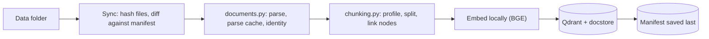
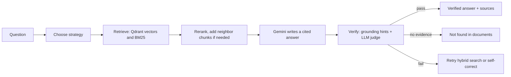

# Verity

**A document Q&A API that checks its own answers.**
Adaptive hybrid retrieval (Qdrant + BM25), cited responses, and hallucination guardrails, served through FastAPI.

Ask a question about your documents and get back an answer with `[Context N]` citations, the sources behind them, and a verification status. If the documents don't contain the answer, Verity says so instead of guessing.

> Add a screenshot or a 60-second GIF of `/docs` or your demo UI here. It is the first thing a reviewer looks at.

## What it does

- **Ingests many file types:** PDF, DOCX, PPTX, images (LlamaParse), Markdown, code, CSV, Excel, JSON, HTML and plain text.
- **Stays in sync:** content hashing finds new, changed and deleted files. Only those are re-processed.
- **Routes each question** to semantic, keyword (BM25), hybrid (reciprocal rank fusion) or summary retrieval.
- **Verifies every answer** against the retrieved evidence before returning it, and retries or refuses when it can't.
- **Exposes a hardened HTTP API** with API-key auth, rate limits, safe uploads and background indexing.

## How it works

Ingestion (a sync):



Answering a question:



## Design decisions

| Problem | Decision |
|---|---|
| Chunks truncated by the embedding model | Chunk sizes are counted with the embedder's own tokenizer, with room reserved for embedded metadata |
| A crash mid-sync leaves index and state disagreeing | The index is persisted first and the manifest saved last, so an interrupted file is simply redone |
| Re-ingesting duplicates or orphans chunks | Deterministic node IDs (file, part, position, content hash) and delete-by-document before insert |
| Paying to re-parse PDFs after every rebuild | Parse results are cached by file hash, outside the storage folder that rebuilds wipe |
| One bad file stopping a whole sync | Failures are recorded per file, retried a bounded number of times, then skipped until the file changes |
| Queries freezing during a long sync | Parsing runs without the state lock; queries only wait for short index swaps |
| Unbounded cost on "summarize everything" | Summary context is capped and sampled across documents |
| Models inventing numbers or names | Citation checks, a literal-grounding check, and a strict LLM judge before any answer is returned |
| Open endpoints burning model quota | API keys, per-client rate limits, a cap on concurrent questions, and request-size and file-type checks |

## Quick start (Docker)

```bash
cp .env.example .env          # add your GEMINI_API_KEY and LLAMA_CLOUD_API_KEY
docker compose up --build
```

Open <http://localhost:8000/docs>. The first start downloads the embedding model, so give it a few minutes; `/ready` returns 200 once the index is loaded.

Put documents in `./data` or upload them through the API, then ask:

```bash
curl -X POST http://localhost:8000/ask \
  -H "X-API-Key: $API_KEY" -H "Content-Type: application/json" \
  -d '{"question": "What is the refund window?"}'
```

If the first sync fails with "Qdrant is not reachable" (the API started before the database was ready), call `POST /sync` or restart the `api` service.

## Run locally (without Docker for the app)

```bash
docker compose up -d qdrant            # the vector database
python -m venv venv && source venv/bin/activate     # Windows: venv\Scripts\activate
pip install -r requirements.txt
cp .env.example .env                   # fill in keys
python -m adaptive_rag.api             # HTTP API on http://127.0.0.1:8000
python main.py                         # or the terminal chat
```

## API

| Endpoint | Purpose |
|---|---|
| `POST /ask` | Answer a question: `{question, mode}` returns answer, status, citations, verification |
| `GET /documents` | List documents and their index status |
| `POST /documents` | Upload a file (indexing runs in the background) |
| `DELETE /documents/{path}` | Remove a document from the index and disk |
| `POST /sync`, `GET /sync` | Start or inspect a sync (`force_rebuild` wipes and re-embeds) |
| `GET /health`, `GET /ready` | Liveness and readiness checks |
| `GET /status`, `GET /metrics` | Operational state and usage counters |

`/ask` returns HTTP 200 with `status` set to `verified`, `no_evidence` or `unverified`. It returns 503 only when it could not answer at all (nothing indexed, or the model or vector store was unreachable).

## Configuration

Secrets and per-deployment values come from the environment (see `.env.example`). Retrieval limits, chunk sizes, guardrail switches and rate limits are constants in `adaptive_rag/config.py`.

## Tests

```bash
pip install -r requirements-dev.txt
python -m pytest tests/api -v
```

The API tests run against a fake engine, so they need no API keys, Qdrant or model downloads and finish in seconds. They cover validation, auth, rate limits, upload safety, background sync behavior and error handling.

## Project structure

```
adaptive_rag/
  engine.py        sync, retrieval, generation, verification
  documents.py     loading, parsing, hashing, manifest
  chunking.py      profiling and token-aware chunking
  retrieval.py     BM25 lexical index
  models.py        LLM and embedding setup
  observability.py usage and timing counters
  api/             FastAPI layer (routes, auth, jobs, schemas)
  cli.py           terminal interface
tests/api/         API test suite
```

## Limitations and roadmap

- **One process.** The engine keeps its index and locks in memory, so run a single worker. Scaling out would mean moving indexing to a separate worker with a job queue, and the rate limiter to Redis.
- **Token counts are estimates.** They come from a generic tokenizer, not Gemini's own accounting.
- **No quantitative evaluation yet.** A labeled question set measuring answer accuracy and refusal rate is the next addition.
- **Not built yet:** streaming answers and conversation history.

## License

MIT
